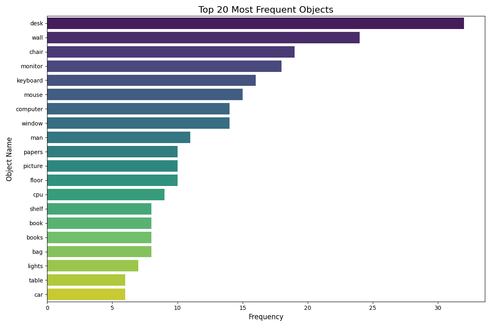
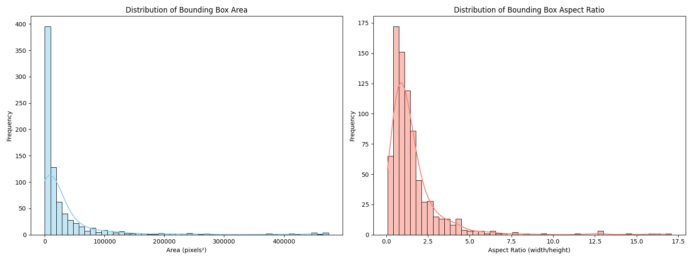

# Data Quality Report: `..\data\processed\processed_objects_flat.csv`

This report summarizes the analysis of **786 objects** from the processed dataset.

## 1. Data Completeness

- ✅ The dataset is fully complete with no missing values.

## 2. Object Frequency

The most common objects provide insight into the dataset's primary context (e.g., indoor office scenes).

## 3. Bounding Box Analysis

The distribution of bounding box sizes and shapes can highlight common object scales and potential outliers.

